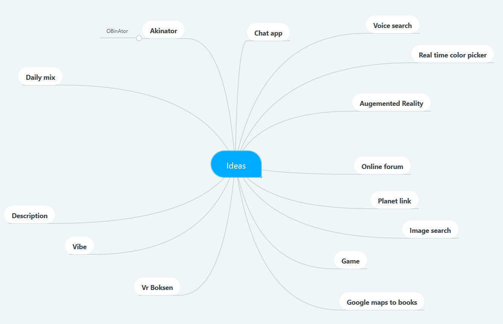
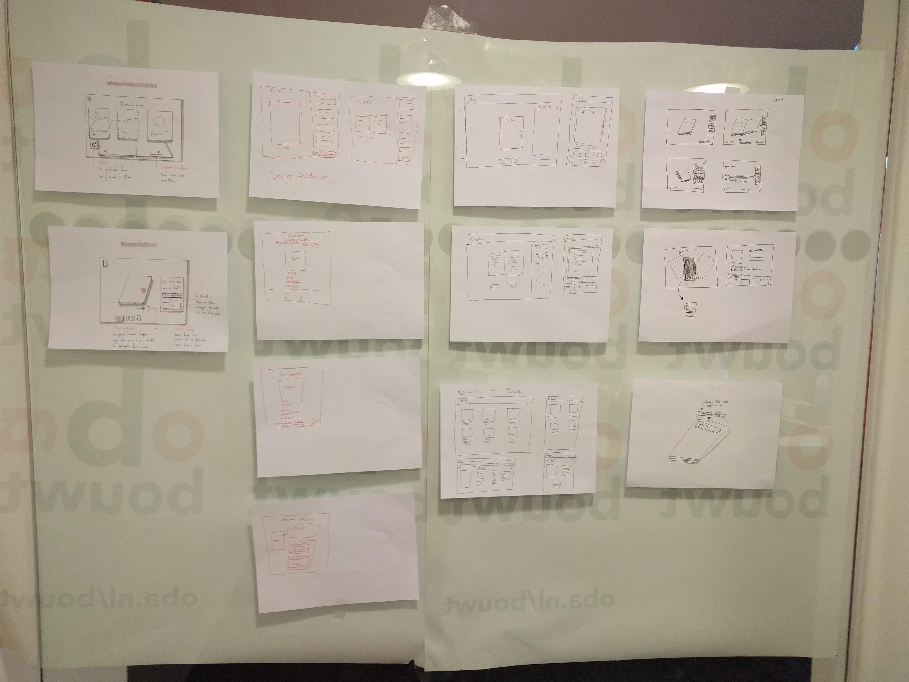
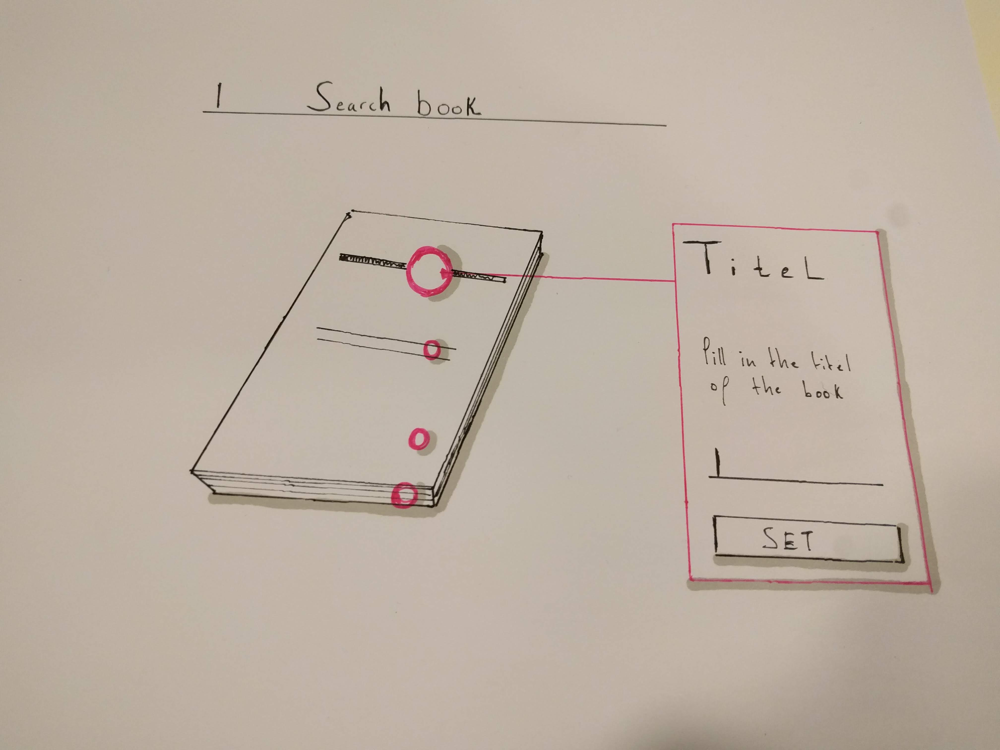

# Boegle
Amsterdam OBA | To search a book

## Table of contents

* [Getting started](##getting_started)
* [Progression](##progression)
    * [Week1](###week1)

## Getting started

Install all dependencies
```
npm install
```

Create .env file in directory and add your preferences
```
HOST = 3000
PUBLIC_KEY = public key name
SECTRET_KEY = secret key name
```

Start application
```
npm start
```

Standard port is 3000
```
localhost:3000
```

## Progression

*The progression section gives a weekly insight to what the team is working on, what for problems we've encountered and how we've dealth with the problems during our project.*

### Week1

The focus of the first week lays on understanding and debriefing the client problem. From there we're creating an user story and and an user scenario that gives us an idea what the visitors of the OBA wants and how the perfect scenario would be. And last but not least creating a concept for solving this solution.

#### User story

The high school student comes in the OBA and is looking for a book. With a description without title and writer, the librarian can do nothing. The student can use the installation next to the desk to find his / her book. The books are filtered by - among other things -  the subject, thickness of the book and the color of the cover. The student finds the right book, can see where it is, whether it is available and then borrow the book.

#### User scenario

The high school student is looking for a book, of which he or she no longer knows the title and the writer. Through a web application, the student can find the book in the OBA.

#### Concept

To comes up with a concept, we first generate ideas that are enable to solve this problem. 

<details>
<summary>Click: to see mindmap of the ideas</summary>

</details>

After generating ideas, every member created their own concept of a web application that will solve the problem. The concept is than shown to the team and at the end of the day the team will pick an aspect of a concept that is suited for solving the problem really wel.

<details>
<summary>Click: to see concepts</summary>
<p>Wall of generated concept</p>


<p>Zoomed in on a concept</p>

</details>